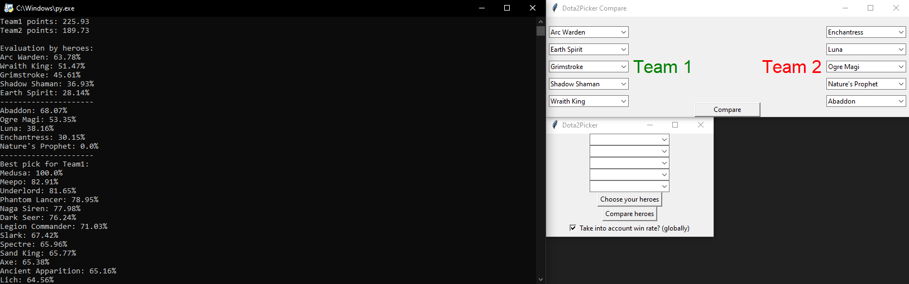

# Dota 2 Picker
Dota2Picker is a script that helps you in selecting heroes based on data such as win rate and individual score from [dotabuff](https://www.dotabuff.com/)

In the folder "update" are files unfinished update which will use the API Dota 2 Startz which also takes into account the synergy of heroes in the team, there are already implemented a total score of each team but I would like to add a full analysis for each hero, as the enemy and allied, I want to do through tables + icons heroes. You can check it out
# Installation
1. Clone the repository:
```
git clone https://github.com/ElRizeru/dota2picker.git
```
2. Navigate to the project directory:
```
cd dota2picker
```
3. Install the required dependencies:
```
pip install -r requirements.txt
```
Or just run `install_requirements.bat`
# Usage
To use Dota2Picker, follow these steps:
1. Run the update.py script:
```
python update.py
```
2. Run the main.py script:
```
python main.py
```
# Screenshot

